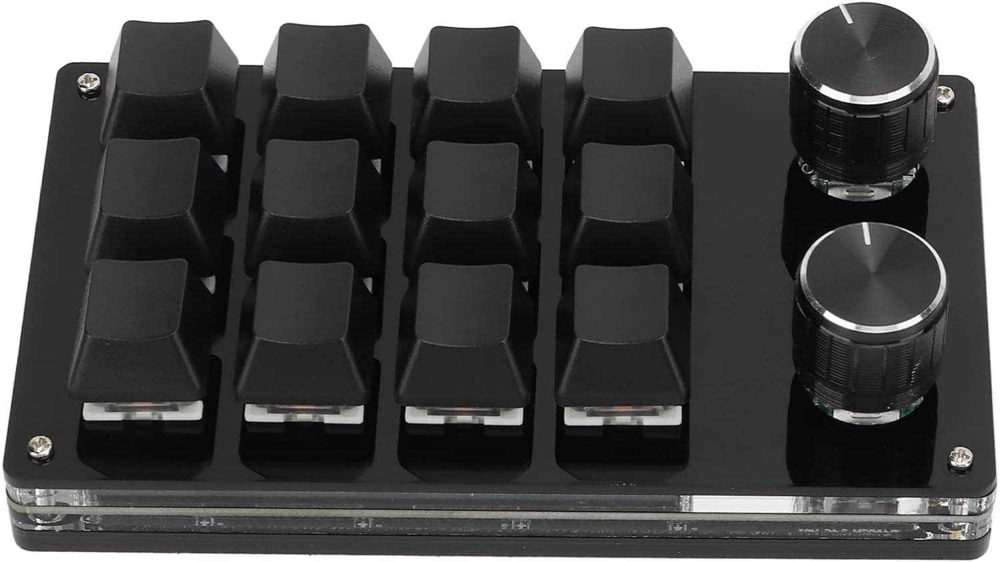

software for https://www.amazon.de/gp/product/B0B1QTDY66/ref=ppx_yo_dt_b_search_asin_title?ie=UTF8&psc=1
12 key + 2 knobs macro keyboard

looks like this but should also work up to 4x4 keys

 

!!!! source is just downlaoded from some google drive zip or something - but it worked so i at least put it here for documentation and SEO (cause it was annoying to find as well , you can probably take the amount of stars as a credibility score 😅)

if you have a different keyboard for which this works please send me a pr to include it in the readme for SEO
